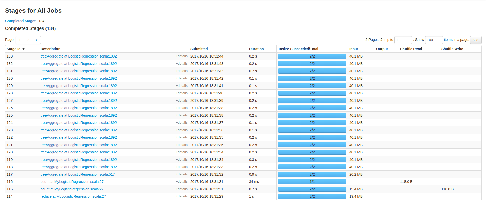
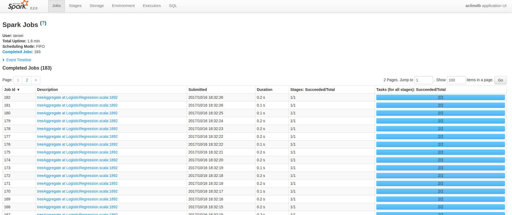

# aclimdb-spark
Simple regression model for aclimdb by Apache Spark

## How to

- Get aclimdb data from http://ai.stanford.edu/~amaas/data/sentiment/ or in `dataset` directory
- Extract data `tar xvf aclImdb_v1.tar.gz`
- Execute `fix.py` to convert 0-base index libsvm format to 1-base index libsvm. Because spark does not support 0-base index libsvm format at all (no way to work around has been found). `fix.py` will look for `aclImdb/train/` and `aclImdb/test/` directories under cwd.
- Go to `intellij-project/`, run `sbt clean package`
- Execute `spark-submit` with appropriated parameters


## Result
- Execute with `spark-submit aclimdb_2.11-0.1.0-SNAPSHOT.jar --master local[16] --executor-memory 15G`

```
Mean squared error by logistic regression: 9.1196
Logistic regression ran in 28.585135914 seconds
Mean squared error by elastic net logistic regression: 8.48344
Elastic net logistic regression ran in 56.857956596 seconds
Overall trained + tested time: 86.689876735 seconds
Finished
```

- Execute with `spark-submit aclimdb_2.11-0.1.0-SNAPSHOT.jar --master local[1] --executor-memory 15G`
```
Mean squared error by logistic regression: 9.1196
Logistic regression ran in 28.851080605 seconds
Mean squared error by elastic net logistic regression: 8.48344
Elastic net logistic regression ran in 55.946061939 seconds
Overall trained + tested time: 86.019659833 seconds
Finished
```

- Not quite different ^^!
- Spark web UI screenshots






